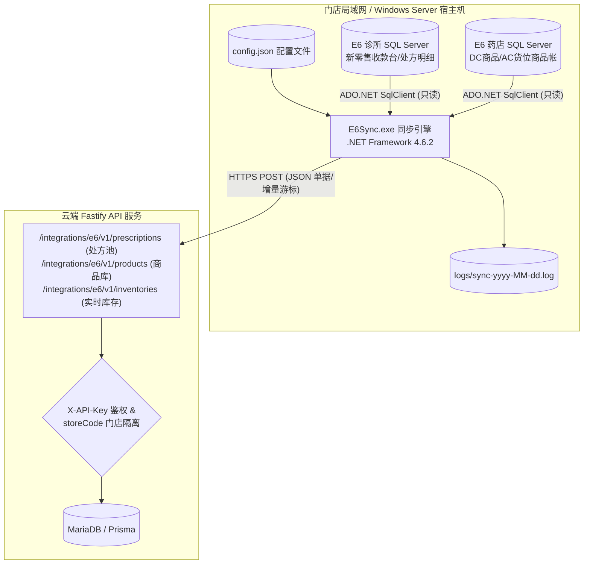

# E6Sync 浪潮佳软 E6 同步工具实施与运维指南

> [!IMPORTANT]
> **模块名称**：`E6Sync` (WinForms Windows 桌面服务)  
> **目标框架**：`.NET Framework 4.6.2` (单文件/无第三方外部依赖)  
> **适用系统**：Windows Server 2008 R2 SP1+ / Windows 10 / Windows 11 / Windows Server 2012/2016/2019/2022  
> **核心原则**：**单向只读提取**。工具绝不向 E6 的 SQL Server 数据库执行任何 `INSERT`、`UPDATE`、`DELETE` 或 `ALTER` 操作。

---

## 1. 架构定位与数据同步流向

`E6Sync.exe` 专用于连接部署在各门店局域网内的浪潮佳软 E6 诊所管理系统及新零售药店管理系统，将处方单据、饮片商品库与实时货位库存，通过标准的 RESTful API 定时增量推送至中药处方加工管理系统后端。



---

## 2. 编译与运行环境要求

### 2.1 编译环境

- **IDE**：Visual Studio 2022 (或 MSBuild v17+)
- **工作负载**：`.NET 桌面开发` (包含 Windows Forms 工具)
- **目标包**：`.NET Framework 4.6.2 Targeting Pack`
- **外部依赖**：**0 外部 NuGet 包**。编译仅引用 .NET Framework 内置程序集：
  - `System.Data.SqlClient` (用于连接 SQL Server)
  - `System.Net.Http` (用于发送 REST API 请求)
  - `System.Web.Extensions` (提供快速稳定的 `JavaScriptSerializer` JSON 序列化)

#### 编译步骤：
1. 双击打开 `E6Sync.sln`。
2. 顶部工具栏切换编译模式为 **`Release`**，目标平台为 **`Any CPU`**。
3. 点击菜单栏 **生成 (Build)** ➔ **生成解决方案 (Build Solution)**。
4. 编译产物位于 `E6Sync\bin\Release\E6Sync.exe`。

### 2.2 生产部署依赖与服务器要求

- **操作系统**：Windows Server 2008 R2 SP1、Windows Server 2012 R2、Windows Server 2016/2019/2022。
- **运行库**：必须已安装 [.NET Framework 4.6.2 离线安装包](https://dotnet.microsoft.com/download/dotnet-framework/net462)。
- **网络访问**：
  - 局域网端口：允许访问本地或内网 SQL Server 实例端口（默认 `1433`）。
  - 出网端口：允许向云端服务器域名发起 `443 (HTTPS)` 或 `80 (HTTP)` 出站连接。
- **文件权限**：当前运行 Windows 登录账号必须对 `E6Sync.exe` 所在目录拥有创建文件和修改日志的权限。

---

## 3. 部署目录与配置字典 (`config.json`)

将编译后的可执行文件复制到服务器目标目录（如 `D:\TCM_Sync\`），结构如下：

```text
D:\TCM_Sync\
├── E6Sync.exe                  # 核心执行文件
├── E6Sync.exe.config           # .NET Framework 运行时配置
├── config.json                 # 核心连接与同步策略配置
└── logs\                       # 运行日志目录（程序首次运行自动生成）
    └── sync-2026-09-05.log     # 按自然日自动滚动的结构化文本日志
```

### 3.1 完整配置文件示例

```json
{
  "e6": {
    "server": "127.0.0.1",
    "database": "E6观前街中医诊所",
    "windowsAuthentication": true,
    "username": "",
    "password": "",
    "defaultDoctorCode": "D001"
  },
  "pharmacyE6": {
    "server": "127.0.0.1",
    "database": "E6苏州药店",
    "windowsAuthentication": true,
    "username": "",
    "password": ""
  },
  "api": {
    "baseUrl": "https://api.tcm.example.com",
    "apiKey": "e6_live_9f83ac127e654cbb823e9a1",
    "storeCode": "SZ001"
  },
  "sync": {
    "intervalSeconds": 60,
    "autoSyncEnabled": true,
    "lastSyncTime": "2026-09-05 20:00:00",
    "pharmacySyncEnabled": true,
    "pharmacyIntervalSeconds": 120,
    "lastPharmacySyncTime": "2026-09-05 20:02:00",
    "lastPharmacyProductModifiedAt": "2026-09-05 18:30:00",
    "lastPharmacyInventoryCursor": "1849201"
  }
}
```

### 3.2 参数详细释义字典

| 节点 | 属性名 | 类型 | 必填 | 详细说明 |
|---|---|:---:|:---:|---|
| **`e6`** (诊所处方库) | `server` | string | 是 | 诊所 SQL Server 实例地址，支持 IP、计算机名或实例名（如 `127.0.0.1\SQLEXPRESS`）。 |
| | `database` | string | 是 | 诊所数据库名称。 |
| | `windowsAuthentication` | bool | 是 | 是否使用 Windows 集成身份验证。若为 `true`，以启动进程的 Windows 账户登录，忽略用户名密码。 |
| | `username` / `password` | string | 否 | 当 `windowsAuthentication` 为 `false` 时的 SQL Server 账号和密码。 |
| | `defaultDoctorCode` | string | 否 | 处方药师保底编码。当 E6 单据中的 `处方药师` 字段为空时，以此编码上报。 |
| **`pharmacyE6`** (药店商品库存库) | `server` / `database` | string | 是 | 药店数据库实例与库名（常与诊所位于同一服务器不同库）。 |
| | `windowsAuthentication` | bool | 是 | 药店库的鉴权方式。推荐设为 `true`。 |
| **`api`** (云端接入配置) | `baseUrl` | string | 是 | 云端 API 网关基础地址，末尾不要带 `/`。 |
| | `apiKey` | string | 是 | 云端后台分配给该门店的专属接入密钥。请求时放入 HTTP Header `X-API-Key`。 |
| | `storeCode` | string | 是 | 门店代码（全大写，如 `SZ001`），必须与 API Key 绑定的门店完全一致。 |
| **`sync`** (调度与增量游标) | `intervalSeconds` | int | 是 | 诊所处方单据轮询周期（秒），推荐 `30` - `120`。 |
| | `autoSyncEnabled` | bool | 是 | 是否开启处方后台自动轮询。 |
| | `lastSyncTime` | string | 自动 | 处方同步最后推进时间点。程序自动更新与持久化。 |
| | `pharmacySyncEnabled` | bool | 是 | 是否开启药店商品与库存增量同步。 |
| | `pharmacyIntervalSeconds`| int | 是 | 药店商品/库存轮询周期（秒），推荐 `60` - `300`。 |
| | `lastPharmacySyncTime` | string | 自动 | 药店全量同步最后执行时间。 |
| | `lastPharmacyProductModifiedAt` | string | 自动 | 商品字典增量修改时间游标（根据 `DC商品.修改日期` 推进）。 |
| | `lastPharmacyInventoryCursor` | string | 自动 | 货位库存变更游标（根据 `AC货位商品帐._c_` 递增版本号推进）。 |

> [!TIP]
> **原子写入机制**：每次同步成功后更新 `config.json` 中的游标，E6Sync 均采用“写入临时文件 ➔ 文件替换”的原子操作，防止服务器突然断电导致配置文件损坏变空。

---

## 4. 数据映射逻辑与业务规则

### 4.1 诊所处方同步 (`POST /integrations/e6/v1/prescriptions`)

1. **单据主明细关联**：
   - 以 `PF新零售收款台_处方明细` 为驱动表，通过明细表的 `PID` 关联主表 `PF新零售收款台.id`。
   - 单据编号提取：`PF新零售收款台.id` ➔ `externalOrderNo`。
   - 过滤作废单据：自动筛除 `_proofstate = '作废'` 的无效单据。
   - 付款状态转换：`_proofstate = '结单'` 标记为 `PAID`，新单等其他流转状态标记为 `UNPAID`。
2. **单位智能折算引擎**：
   - 中药处方单剂克数（`items[].quantity`）：读取 `单付数量` 与 `单位`，针对 `10g`、`10克`、`g`、`克` 等重量标识统一换算为标准克（`g`），且**不乘付数**。
   - 处方总重（`items[].totalQuantity`）：读取 `数量` 乘以单位系数换算为总克数。
   - 计件类（如 `条`、`个`）：保持数量不变直接透传。
3. **防漏单回退窗口**：
   - 自动增量查询采用安全回退策略：每次扫描从 `lastSyncTime - 2 分钟` 至当前时间，有效规避 SQL Server 事务提交延迟造成的漏单。

### 4.2 药店商品与库存同步

1. **商品信息增量同步**：
   - 监听 `DC商品` 表中 `修改日期 > @lastModified` 的记录。
   - 提取总部商品编码 `productCode`（使用统一物料编码）、品名、剂型、规格、批准文号、生产企业、零售价等。
2. **货位库存增量同步**：
   - 监听 `AC货位商品帐` 表，利用 SQL Server 行级变更标志 `_c_ > @lastCursor` 高性能提取有变动的批次。
   - 上传生产批号、有效期至、当前结存数量、入库日期以及所处的物理货位名称。
3. **全量校准机制**：
   - 手动点击“药店全量同步”时，系统将扫描全库正库存并提交服务端比对，自动剔除云端已在 E6 中盘亏或出库为零的历史死批次。

---

## 5. 日常运维、托盘与监控

### 5.1 界面交互与托盘常驻

- **无黑色 CMD 弹窗**：纯 WinForms 视窗，内置富文本运行日志流。
- **系统托盘最小化**：点击窗口右上角关闭按钮 `[X]` 不会退出程序，而是自动缩减为右下角任务栏通知区域图标。
- **托盘右键菜单**：
  - 显示/隐藏主面板
  - 暂停 / 恢复 处方自动同步
  - 暂停 / 恢复 药店库存同步
  - 安全退出程序

### 5.2 联调与测试步骤

1. **测试 SQL 连通性**：点击“测试 SQL 连接”与“测试药店 SQL”，验证本地 Windows 身份认证和只读授权。
2. **选择区间手动试跑**：首次接入，选择前一天或今天的日期范围，点击“诊所处方同步”。
3. **检查响应码**：
   - 若状态为 `待确认` 或 `已存在(duplicate=true)`，说明网络与 API 鉴权全部打通。
   - 若状态为 `待映射`，说明当前订单的医生编号在云端未维护，需登录 Web 管理端补充映射关系。
4. **开启自动调度**：勾选“启用自动同步”，随后最小化到托盘即可。

---

## 6. 常见故障排查 (Troubleshooting)

### Q1: 提示“Cannot open database requested by the login. The login failed.”
- **原因**：运行 E6Sync 的当前 Windows 登录账户在 SQL Server 中没有分配权限。
- **解决方案**：打开 SQL Server Management Studio (SSMS)，在 `安全性 ➔ 登录名` 中添加当前 Windows 账号（或 `Everyone`/`Users` 组），在 `用户映射` 中勾选目标数据库的 `db_datareader` (只读) 角色权限。

### Q2: 提示“HTTP 401 Unauthorized”
- **原因**：`config.json` 中的 `apiKey` 不正确，或者 `storeCode` 与该 API Key 所属的门店不一致。
- **解决方案**：登录 Web 管理端，进入 **系统设置 ➔ 门店管理**，重新复制该门店专用的 E6 API Key 并核对大写门店编码。

### Q3: 电脑重启后同步中断了怎么办？
- **解决方案**：
  1. 将 `E6Sync.exe` 的快捷方式放入 Windows 的启动文件夹（按 `Win + R` 输入 `shell:startup`）。
  2. 或配置为 Windows 任务计划程序，勾选“不管用户是否登录都要运行”。
  3. 由于 `config.json` 保存了最后同步的时间戳，程序重新启动后会自动从上一次成功的位置继续向后抓取，绝不会丢失中间产生的订单。
