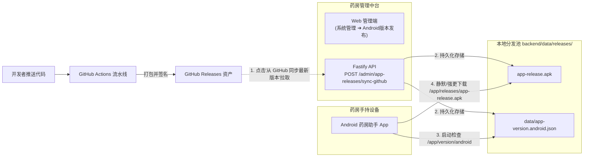

# Android APK 自动发布与分发管理系统

> [!IMPORTANT]
> **目录作用**：存放 Android 药房助手正式发布的已签名 APK 文件（如 `app-release.apk`）与版本元数据。  
> **服务路径**：客户端可通过 `GET /app/releases/<filename>.apk` 接口进行高速直链下载，无需经过第三方网盘或应用商店。

---

## 1. 自动化发版流向与架构

系统提供了一套无缝衔接 GitHub Actions CI/CD 与本地私有分发池的自动化机制：



---

## 2. 核心操作流程

### 方式 A：管理后台一键拉取 (推荐 / 运营与运维人员日常使用)

1. **前提配置**：确保 `backend/.env` 中配置了对应的 GitHub 仓库信息：
   ```env
   GITHUB_REPOSITORY="your-org/tcm-prescription-processing"
   # 若仓库为私有仓库，需提供具备 read:packages 或 repo 权限的个人访问令牌 (PAT)
   GITHUB_TOKEN="ghp_xxxxxxxxxxxxxxxxxxxxxxxxxxxx"
   ```
2. **触发同步**：
   - 使用管理员账号登录 **Web 管理端 (PC)**。
   - 导航至 **系统管理 ➔ Android版本发布**。
   - 点击右上角 **从 GitHub 同步最新版本** 按钮。
3. **后端自动清洗与抓取**：
   - 后端服务（`githubReleaseService.js`）通过 GitHub API 获取最新 Release Tag 与 Release APK 文件；
   - **智能提取更新日志**：若 Release Body 包含发布说明则自动清洗；若为空或通过特定工作流发布，系统会自动解析近期的 Git 提交历史，过滤内部杂项并将业务特性（`feat:` / `fix:`）格式化为纯文本换行列表存储在 `releaseNotes` 中，便于手持端 App 优雅排版显示；
   - 自动覆盖写入本地 `app-release.apk`，原子更新 `data/app-version.android.json`。

### 方式 B：服务器 CLI 命令行脚本触发 (CI/CD 钩子场景)

如需通过 Webhook 或运维脚本全自动执行同步：

```bash
cd backend
npm run sync:android-release
```

该脚本 (`scripts/syncAndroidRelease.mjs`) 会直接在终端输出拉取进度与哈希校验结果。

### 方式 C：纯离线手动部署模式

若服务器处于完全无法访问外网 GitHub 的机房专网环境：

1. 手动将本地构建并签名好的 APK 文件重命名并放置在此目录下：
   `backend/data/releases/app-release.apk`
2. 编辑版本控制元数据文件 `backend/data/app-version.android.json`：
   ```json
   {
     "versionCode": 102,
     "versionName": "1.0.2",
     "minSupportedVersionCode": 100,
     "apkUrl": "/app/releases/app-release.apk",
     "apkSha256": "3a7b8c...",
     "releaseNotes": "1. 优化离线条码识别灵敏度\n2. 修复跨店调拨偶发性白屏问题",
     "forceUpdate": false,
     "publishedAt": "2026-09-05T12:00:00Z"
   }
   ```
3. 保存后无需重启 Node.js 服务，所有手持机下次打开 App 时即刻感知到新版本。
