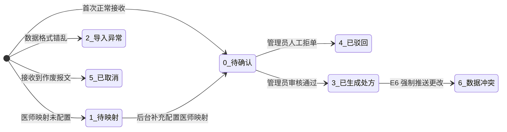

# E6 处方数据同步 API 对接文档

> [!IMPORTANT]
> **版本**：`v1.1`  
> **更新日期**：`2026-09-05`  
> **适用对象**：浪潮佳软 E6 系统开发、实施及联调人员

---

## 1. 接口架构与用途

E6 系统通过本接口将门诊处方订单数据单向同步到中药处方加工系统。为了保证医疗处方的严谨性，**接口接收成功后，数据仅落入“待确认导入池”，不会直接越权生成正式处方。** 必须由门店药师或管理员在系统后台人工核对、补充加工方式、指定加工日期并审核确认后，系统才会正式排产。

> [!NOTE]
> 本同步为单向写入机制（E6 ➔ 中药系统）。本接口绝对不会反向连接或修改 E6 数据库。

---

## 2. 接口定义

### 基本信息

- **请求协议**：`HTTPS`
- **HTTP 方法**：`POST`
- **请求路径**：`/integrations/e6/v1/prescriptions`
- **完整 URL 示例**：`https://api.tcm.example.com/integrations/e6/v1/prescriptions`

### 请求鉴权 (API Key)

每个门店均分配有严格隔离的独立 `API Key`。请务必将其置于 HTTP Request Header 中：

```http
X-API-Key: e6_xxxxxxxxxxxxxxxxxxxxxxxxxxxxxxxxxxxxxxxxxxx
Content-Type: application/json; charset=utf-8
```

> [!CAUTION]
> 1. 请求体中的 `storeCode` 必须与该 API Key 绑定的门店完全匹配，否则将触发 HTTP `401 Unauthorized`。
> 2. **切勿**将 API Key 打印在普通业务日志、URL 参数或客户端直传报文中，避免凭据泄露。

---

## 3. 请求参数结构

### 3.1 主表参数 (`Request Body`)

| 字段 | 类型 | 必填 | 长度/约束 | 业务说明 |
|---|---|:---:|---|---|
| `externalOrderNo` | `string` | **是** | 1-100 字符 | **E6 原始订单号**。需保证在单个门店内的绝对唯一性，且后续更新时不得更改。 |
| `storeCode` | `string` | **是** | 2-50 字符 | **门店编码**。需与系统中配置的门店编码一致（通常为全大写）。 |
| `customerName` | `string` | 否 | ≤ 64 字符 | 顾客姓名（允许传空字符串）。 |
| `phone` | `string` | 否 | 11位合规手机号 | 顾客手机号（若无联系方式可传空，但建议尽量获取以便发送取药短信）。 |
| `e6DoctorCode` | `string` | 否* | 1-100 字符 | **E6 医师工号**。中药系统将根据配置的「医师映射表」将其转换。 |
| `totalPrice` | `string` | **是** | 金额字符串 | **订单总价**（精确到 2 位小数）。推荐传字符串防止浮点数精度丢失，如 `"268.00"`。 |
| `paymentStatus` | `string` | 否 | `PAID` / `UNPAID` | 订单支付状态，根据 E6 收款台状态计算（结单为 PAID）。 |
| `sourceStatus` | `string` | 否 | `ACTIVE` / `CANCELLED` | 单据存续状态，若订单在 E6 被作废请传入 `CANCELLED`。 |
| `doseCount` | `integer`| **是** | `> 0` | 处方总**剂数**（总付数）。 |
| `items` | `array` | **是** | 至少 1 项 | 处方的中药饮片明细列表（详见 3.2 节）。 |
| `remark` | `string` | 否 | ≤ 500 字符 | 处方备注（如服药禁忌、用法用量）。超长将被截断。 |
| `sourceCreatedAt` | `string` | 否 | ISO 8601 | 订单创建时间（须带时区，如 `+08:00`）。 |
| `sourceUpdatedAt` | `string` | 否 | ISO 8601 | 订单最后修改时间（须带时区）。 |

### 3.2 处方明细 (`items` 对象)

| 字段 | 类型 | 必填 | 业务说明 |
|---|---|:---:|---|
| `sequence` | `integer`| **是** | 明细显示顺序（对应 E6 `ri` 字段）。单张处方内不可重复。 |
| `name` | `string` | **是** | 中药饮片名称（如 `黄芪`）。 |
| `quantity` | `string` | **是** | **单剂数量**。请先在 E6 本地将所有重量单位折算为 `克`（不乘付数）。件数单位（条/个）保持原数。 |
| `totalQuantity` | `string` | **是** | **总数量**。请在 E6 本地将重量单位折算为 `克`。 |
| `unit` | `string` | **是** | 单位。重量统一传 `g`，计件可传 `条` 或 `个`。 |
| `doseCount` | `integer`| **是** | 该味药的具体付数（通常与主表一致，个别引药可能不同）。 |

### 3.3 请求 JSON 报文示例

```json
{
  "externalOrderNo": "E6-20260726-000123",
  "storeCode": "SZ001",
  "customerName": "张三",
  "phone": "13800138000",
  "e6DoctorCode": "D001",
  "totalPrice": "268.00",
  "doseCount": 7,
  "items": [
    { "sequence": 1, "name": "北柴胡", "quantity": "6", "totalQuantity": "42", "unit": "g", "doseCount": 7 },
    { "sequence": 2, "name": "白芍", "quantity": "15", "totalQuantity": "75", "unit": "g", "doseCount": 5 },
    { "sequence": 3, "name": "阿胶", "quantity": "1", "totalQuantity": "7", "unit": "条", "doseCount": 7 }
  ],
  "remark": "饭后温服",
  "sourceCreatedAt": "2026-07-26T10:22:00+08:00",
  "sourceUpdatedAt": "2026-07-26T10:25:00+08:00"
}
```

---

## 4. 响应定义与状态流转

### 4.1 成功响应 (HTTP 200)

```json
{
  "code": 0,
  "message": "同步成功",
  "data": {
    "importId": 81,
    "externalOrderNo": "E6-20260726-000123",
    "status": 0,
    "duplicate": false
  }
}
```

**响应参数说明**：
- `code`: `0` 标志数据已成功落盘至中间池。
- `data.status`: 返回该订单当前在系统中处于哪个审批阶段（见下表）。
- `data.duplicate`: 若 E6 端进行了完全重复的发送（内容无任何改变），系统将直接返回成功且 `duplicate = true`，**该情况不是报错**。

### 4.2 导入池状态码 (`status`) 及其业务含义



| `status` 值 | 系统状态 | E6 端处理要求 |
| :---: | --- | --- |
| **`0`** | **待确认** | 正常流转中。**无需重试**，请等待药房管理员审核。 |
| **`1`** | **待映射** | 正常流转中。因门店尚未配置该医师编码，被拦截。**无需重试**，药房人员配置后系统将自动恢复流转。 |
| **`2`** | **导入异常** | 记录已落盘，但解析失败。联系技术排查。 |
| **`3`** | **已生成处方** | 审批结束，已转为正式加工订单。**无需重试**。 |
| **`4`** | **已驳回** | 该处方被药师打回（可能无需加工或有禁忌），终止流转。 |
| **`5`** | **已取消** | 成功接收到了作废单据（`sourceStatus = CANCELLED`）。 |
| **`6`** | **数据冲突** | **严重警告**：处方已正式投产后，E6 再次变更了内容并推送。系统拦截修改，需双方人工核对。 |
| **`7`** | **处理中** | 高并发事务处理锁。可短暂延迟后重试查询。 |

---

## 5. 错误响应与重试策略

### 5.1 失败响应示例 (HTTP 4xx/5xx)

```json
{
  "code": -1,
  "message": "E6医师编码为空，当前门店有多个启用映射，无法确定医生"
}
```

### 5.2 常见错误拦截对照表

| HTTP 状态码 | 报错场景与常见提示 | E6 端动作要求 |
| :---: | --- | --- |
| `400` | 字段校验失败（如“请输入 E6 原始订单号”、“剂数必须为正整数”） | **终止重试**。修改程序或脏数据后方可再发。 |
| `401` | `API Key` 不正确，或 `storeCode` 门店编码不匹配 | **终止重试**。核对 API Key 是否填错。 |
| `429` | 请求并发频率超出限流阈值 | 采用退避算法（如 10 秒后）进行**自动重试**。 |
| `500` | 后端服务异常或网络断开 | 延迟重试（推荐间隔 1分、5分、15分、30分）。 |

> [!TIP]
> **防重复防漏单规则**：
> 1. E6 本地必须保存「发送队列」与「最终响应状态」，防范断电丢单。
> 2. 网络超时未收到 HTTP 响应时，**必须使用相同的 `externalOrderNo` 原样重试**，严禁生成新的订单号，否则会导致药房重复煎药！

---

## 6. 代码集成示例

### 6.1 CURL 快速验证

```bash
curl -X POST "https://api.tcm.example.com/integrations/e6/v1/prescriptions" \
  -H "X-API-Key: e6_xxxxxxxxxxxxxxxxxxxxxxxxxxxxxxxx" \
  -H "Content-Type: application/json" \
  -d '{
    "externalOrderNo":"E6-2026-12345",
    "storeCode":"SZ001",
    "totalPrice":"100.00",
    "doseCount":7,
    "items":[{"sequence":1,"name":"人参","quantity":"10","totalQuantity":"70","unit":"g","doseCount":7}]
  }'
```

### 6.2 C# (HttpClient) 稳健调用范例

```csharp
using System.Net.Http.Json;
using System.Text.Json;

// 建议配置为全局单例，设置 15 秒超时
private static readonly HttpClient client = new HttpClient { Timeout = TimeSpan.FromSeconds(15) };

public async Task SyncPrescriptionAsync(object payload, string apiKey, string baseUrl)
{
    using var request = new HttpRequestMessage(HttpMethod.Post, $"{baseUrl}/integrations/e6/v1/prescriptions");
    request.Headers.Add("X-API-Key", apiKey);
    request.Content = JsonContent.Create(payload);

    // 1. 发送请求
    using var response = await client.SendAsync(request);
    var responseText = await response.Content.ReadAsStringAsync();

    // 2. 检查 HTTP 层面
    if (!response.IsSuccessStatusCode)
    {
        throw new Exception($"[网络或授权异常] HTTP {(int)response.StatusCode} - {responseText}");
    }

    // 3. 检查业务 Code 层面
    using var json = JsonDocument.Parse(responseText);
    var code = json.RootElement.GetProperty("code").GetInt32();
    if (code != 0)
    {
        throw new Exception($"[业务校验驳回] 报文异常: {responseText}");
    }
    
    // 成功！可记录 json.RootElement.GetProperty("data").GetProperty("status").GetInt32()
}
```

---

## 7. 联调检查清单 (Checklist)

在正式生产环境上线前，请对接双方联检以下场景：

- [ ] **正常首推测试**：发送成功，HTTP 200，且 `duplicate = false`。在管理后台检查各字段是否折算正确。
- [ ] **幂等重推测试**：使用完全相同的报文再次发送，返回 HTTP 200，且 `duplicate = true`，系统内无重复单据。
- [ ] **更新推送测试**：在管理员未确认前，更改报文中药味的克数并再次发送，管理后台应更新为最新克数。
- [ ] **鉴权阻断测试**：使用错误的 API Key 或错误的 `storeCode` 发送，断言是否严格返回 `401 Unauthorized`。
- [ ] **数据冲突拦截测试**：在管理后台将该订单确认为“已生成处方”后，E6 端再次篡改药材并发送，断言响应 `status = 6` (数据冲突)，处方库内容不应被篡改。
