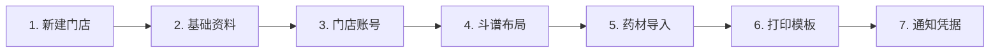
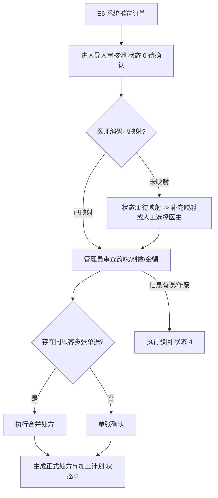
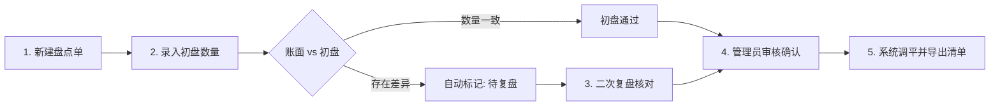

# 中药处方加工与取药管理系统操作使用手册（SOP）

**TCM Prescription Processing & Pickup Management Standard Operating Procedure**

本文档面向全局管理员、门店管理员以及门店一线员工（调剂员、煎药员、核销员），提供系统完整业务生命周期的标准操作规程（SOP），覆盖 Web 管理控制台、微信小程序移动工作台以及 Android 原生“药房助手”手持端。

---

## 目录

1. [系统入口与权限体系](#1-系统入口与权限体系)
2. [系统初始化配置（管理员篇）](#2-系统初始化配置管理员篇)
3. [处方与外方管理 SOP](#3-处方与外方管理-sop)
4. [E6 诊所处方导入与审核池](#4-e6-诊所处方导入与审核池)
5. [加工工作台与工序流水线 SOP](#5-加工工作台与工序流水线-sop)
6. [热敏标签设计与打印规范](#6-热敏标签设计与打印规范)
7. [取药通知与包裹核销闭环 SOP](#7-取药通知与包裹核销闭环-sop)
8. [智能斗谱与库位管理 SOP](#8-智能斗谱与库位管理-sop)
9. [商品盘点、库存差异与门店调拨](#9-商品盘点库存差异与门店调拨)
10. [移动端专属实操（小程序 & Android）](#10-移动端专属实操小程序--android)
11. [高频问题排错指南（FAQ）](#11-高频问题排错指南faq)
12. [中药调剂与数据安全合规准则](#12-中药调剂与数据安全合规准则)

---

## 1. 系统入口与权限体系

### 1.1 三大终端入口对比

| 终端 | 适用硬件 | 定位与核心场景 | 访问与获取方式 |
| --- | --- | --- | --- |
| **Web 管理端** | PC 电脑（推荐 Chrome / Edge 浏览器） | 综合管理控制台：处方全量维护、排队调度、斗谱布局、盘点审核、打印模板设计、短信/机器人参数配置、操作日志审计 | 由部署人员提供内网/公网访问域名（如 `https://admin.tcm.example.com`） |
| **微信小程序** | 员工智能手机 / 微信环境 | 轻量移动工作台：现场查验概览指标、斗谱快速检索货位、加工各阶段打卡、移动扫码核销包裹 | 微信扫描企业内部小程序码或搜索已发布的小程序名称 |
| **Android 药房助手** | 门店 Android 手持 PDA / 平板 / 手机 | 现场工业化作业终端：内置 CameraX + ML Kit 离线 SKU 扫码、调配药材拍照留存、煎药工序流水线打卡、取货码快速核销 | 在 Web 管理端「移动端发布」下载最新 APK 安装包或扫码安装 |

### 1.2 四大角色权限矩阵

系统根据登录账号严格隔离数据和菜单功能：

```text
┌────────────────────────────────────────────────────────────────────────┐
│                        全局管理员 (Role 0)                             │
│   - 全部门店数据、系统基础字典、通知凭据配置、打印模板、全局日志、APP发布   │
└──────────────────────────────────┬─────────────────────────────────────┘
                                   │
┌──────────────────────────────────▼─────────────────────────────────────┐
│                        门店管理员 (Role 2)                             │
│   - 所属门店处方/加工/包裹/斗谱/调拨/盘点/差异完全控制、本门店员工账号管理  │
└──────────────────────────────────┬─────────────────────────────────────┘
                                   │
┌──────────────────────────────────▼─────────────────────────────────────┐
│                        门店员工 (Role 3)                               │
│   - 现场日常作业：排队开工、调配拍照、工序流水打卡、包裹核销、斗谱查药      │
│   - 调拨业务放行：跨门店调拨全流程（发起申请/调入确认/出库扫码/入库打卡）  │
│   - 审批隔离保护：E6 处方导入池只读、库存差异台账只读（无权审核或审批）     │
└────────────────────────────────────────────────────────────────────────┘

┌────────────────────────────────────────────────────────────────────────┐
│                        普通用户/顾客 (Role 1)                          │
│   - 用户端 Web / 小程序普通用户入口：查验本人处方进度、取货码、自提二维码凭证│
└────────────────────────────────────────────────────────────────────────┘
```

- **数据隔离规则**：门店管理员与门店员工登录后，系统强制锁定其所属门店 ID，无法查阅或篡改其他门店的处方与库存数据；全局管理员可在顶部或搜索栏自由切换查看「全部门店」或指定门店。
- **登录状态管理**：系统采用双重 Token 校验，退出登录或多端冲突时会安全清除本地凭据。共用电脑或公用 PDA 使用完毕后必须执行「退出登录」。

---

## 2. 系统初始化配置（管理员篇）

连锁门店新系统上线时，请全局管理员按以下 7 步标准化顺序完成冷启动配置，以确保后续处方创建与加工流程顺畅：



### 步骤 1：创建并启用门店
- 路径：`系统管理 ➔ 门店管理`
- 点击「新增门店」，录入门店名称（如“苏州观前街店”）、唯一门店编码（如 `SZ001`，必须与 E6 ERP 编码一致）、门店地址、联系电话。
- 设置斗谱初始规格：抽屉层数（默认 8）、抽屉列数（默认 5）、顶层列数、大柜单元数及层数。
- 生成 E6 接入密钥：若该门店需要接入 E6 诊所处方同步，在门店详情中生成 `API Key`（系统通过 bcrypt 密文存储，请妥善复制分发给 E6 实施人员）。

### 步骤 2：维护基础资料（医生与字典）
- 路径：`系统管理 ➔ 基础资料`
- **医生档案**：录入常驻门诊中医师姓名、职称、联系电话；支持软删除以确保历史处方关联完整。
- **业务字典**：维护「加工方式」（如：代煎水沉、传统水煎、浓缩膏方、中药颗粒、打粉装胶囊）、「处方来源」（如：门诊开具、便民门诊、互联网医院、院外自持）、「包装规格」等。

### 步骤 3：分配门店管理账号与员工账号
- 路径：`系统管理 ➔ 门店账号`
- 点击「新增账号」，录入手机号、姓名、初始密码，选择角色（**门店管理员** 或 **门店员工**），并绑定具体所属门店。

### 步骤 4：配置智能斗谱空间布局
- 路径：`业务管理 ➔ 斗谱管理 ➔ 布局设置`
- 针对各门店设置实际百子柜网格（每层几列抽屉）、大柜、冷藏冰箱及仓库等物理区域，系统自动生成对应的三维/二维空间网格。

### 步骤 5：药材绑定与初始货位导入
- 路径：`业务管理 ➔ 斗谱管理`
- 点击「下载导入模板」，在 Excel 中填写中药名称、拼音简码、药材编码、所在区域（斗/柜/冰箱/库）、抽屉号及格内序号（如左/中/右/前/后）。
- 点击「导入药材」，系统完成预检并批量绑定入格。

### 步骤 6：校准热敏打印模板
- 路径：`系统管理 ➔ 打印设置`
- 检查「加工标签」、「包装标签」、「取货标签」的页面排版；根据各门店热敏打印机纸张规格（如 80mm×50mm 或 60mm×40mm）配置宽度、内边距、二维码尺寸及是否展示剂数、医生、备注等。

### 步骤 7：配置多通道通知凭据与测试
- 路径：`系统管理 ➔ 短信设置 / 邮件设置 / 群机器人通知`
- **短信通知**：支持配置阿里云、腾讯云或火山引擎 AccessKey，设置模板 CODE，点击「测试发送」向指定手机号发送验证码确认配置生效。
- **群机器人**：录入企业微信、钉钉或飞书的 Webhook 地址，按门店勾选订阅事件（如“加工完成提醒”、“加急处方提醒”），发送测试消息验证连通性。

---

## 3. 处方与外方管理 SOP

### 3.1 录入自建处方
1. 进入 `处方管理 ➔ 新建处方`。
2. （全局管理员需先指定所属门店；门店账号自动锁定所属门店）。
3. 录入**顾客姓名**与**联系电话**（11 位合规手机号）。
4. 选择开方**医生**、**处方来源**、录入处方**总剂数**（如 7 剂、14 剂）与**处方总金额**。
5. 录入用法用量与特殊交代备注（如“饭后半小时温服，忌辛辣生冷”）。
6. 点击「提交保存」，系统自动生成格式为 `RX-YYYYMMDD-XXXX` 的唯一处方编号。

### 3.2 登记外方（院外处方）
1. 在新建处方界面打开「外方」开关。
2. 补充填写**开具机构**（如“苏州市中医院”）、**外院医生姓名**以及**外方说明**。
3. 点击「上传附件」，通过手机拍照或电脑扫描件上传纸质外方原始凭据（支持多图）。
4. 上传完成后核对药味数与剂数，确保原始凭证图像清晰无遮挡，以备监管稽查。

### 3.3 处方修改、作废与删除规则
- **修改限制**：仅未开始排产加工的处方允许修改基本资料。
- **删除限制**：**严禁随意删除已排产处方**。系统仅允许物理删除“从未创建过加工计划”的草稿处方；若处方已拆分批次但顾客退费，应在处方详情中将状态变更为「已取消」，系统将保留完整业务痕迹与操作审计日志。

---

## 4. E6 诊所处方导入与审核池

系统与浪潮佳软 E6 采用单向安全同步架构。外部推送数据首先汇聚在「E6 处方导入审核池」，必须由药房管理员审核确认后才正式进入处方库，绝不自动越权生成。



### 4.1 导入记录状态代码与处理对策

| 状态码 | 状态描述 | 业务含义与操作指引 |
| :---: | :---: | --- |
| **`0`** | **待确认** | 正常同步到达，医生映射正确，等待门店管理员复核并点击「确认导入」。 |
| **`1`** | **待映射** | E6 传入的医师编码未在系统内建立映射。请点击「配置映射」关联对应医生，或在确认弹窗中手动指定医生。 |
| **`2`** | **导入异常** | 报文字段缺失或格式非法。点击「异常重校验」重新跑校验规则，或联系技术运维。 |
| **`3`** | **已生成处方** | 业务已流转完成，系统已成功创建对应的正式处方与 ProcessingPlan。 |
| **`4`** | **已驳回** | 管理员核实该单无需加工或已在外部作废，驳回后不可再转处方。 |
| **`5`** | **已取消** | 来源端单据状态为作废（`sourceStatus = CANCELLED`），系统自动标识取消。 |
| **`6`** | **数据冲突** | 正式处方已生成后，E6 再次变更了内容并推送。系统自动拦截并报警，需人工核实。 |
| **`7`** | **处理中** | 正在执行高并发事务转换，稍等 2 秒刷新即可。 |

### 4.2 审核确认与合并处方操作
1. 进入 `业务集成 ➔ E6 处方导入`。
2. 筛选状态为「待确认」或「待映射」的列表，点击查看明细。
3. **核查明细**：核对顾客姓名、手机号、E6 药师编码、总付数（剂数）、每味药的单剂克数及总克数（系统已自动将 E6 单位折算归一化为 `g`）。
4. **合并导入**：若同一位顾客在短时间内开具了主方与副方，勾选多条记录后点击「合并处方导入」，系统将自动汇总总剂数并生成合并加工单。
5. 点击「确认生成」，系统在原子事务内完成两项操作：
   - 生成正式处方 `Prescription`。
   - 生成首批加工计划 `ProcessingPlan`，并分配独立的 6 位取货码。

---

## 5. 加工工作台与工序流水线 SOP

### 5.1 批次计划拆分与取货码生成
中药处方常面临“先煎 3 剂应急、余下 11 剂分批次煎煮”或“部分自提、部分快递”的复杂业务场景：
1. 进入 `加工管理 ➔ 加工工作台 ➔ 新建加工计划`（或在处方详情中点击「拆分加工计划」）。
2. 选择目标处方，点击「添加批次」：
   - **批次 1**：分配 3 剂，加工方式「传统水煎」，取货方式「自提」，计划完工「今日 16:00」，优先级「加急」。
   - **批次 2**：分配 11 剂，加工方式「代煎水沉」，取货方式「快递」，计划完工「后天 12:00」，优先级「普通」。
3. **校验原则**：所有拆分批次的剂数合计**必须严格等于**处方总剂数，批次号不可重复。
4. **核心特性**：保存成功时，系统会为**每一个加工计划批次生成永久唯一的 6 位数字取货码**（界面按 `XXX-XXX` 格式展示）。后续所有包装标签、通知短信、取货凭证均沿用该码，彻底根绝“改单换码”导致的数据错位。

### 5.2 看板排队调度与加急置顶
- **多维视图**：看板顶部直观汇总「今日待加工」、「逾期任务」、「加工中」、「加急任务」及「明日任务」。
- **拖拽调度**：在「今日待加工」队列中，长按或鼠标拖拽任务卡片上下移动，调整排队优先级。
- **重置队列**：若调度混乱，点击「恢复默认排序」，系统将自动按照“加急优先 ➔ 完工时间先后 ➔ 创建时间先后”重新排定工序流。

### 5.3 调配拍照合规存证（调剂员操作）
根据中药饮片调剂合规要求，中药在下锅或打包前需留存称量配方凭证：
1. 调剂员抓配中药完毕后，在工作台任务卡片点击「拍照存证」（或在 Android 药房助手点击相机图标）。
2. 拍摄药盘/药筐整体药味及处方签，确认照片清晰后点击「上传留档」。
3. 系统将照片安全持久化至服务器存储，并在处方详情时间轴生成调配审计日志。

### 5.4 工序流水线打卡作业（煎药员操作）

大型煎药中心支持细化打卡：**浸泡 ➔ 煎煮 ➔ 浓缩 ➔ 打包**：

```text
[待加工] ──(调配拍照)──► [浸泡开始] ──► [浸泡完成/开煎] ──► [煎煮完成] ──► [开始打包] ──► [加工完成]
                                │               │                │
                                └───(设备故障转移/工序作废记录)─────┘
```

1. **工序打卡**：
   - 在任务详情「工序记录」中选择当前工序（如“煎煮”），输入或扫描**煎药机机号二维码**。
   - 点击「开始工序」，系统记录开工时间与操作工号。
   - 达到设定时长后，点击「完成工序」。
2. **设备故障紧急转移**：
   - 煎药机突发断电或温控故障时，点击工序右侧「设备故障转移」。
   - 录入故障原因，扫描备用机器编号，系统自动将正在运行的剩余时长迁移至新设备，保持流水线数据连续。
3. **异常工序作废**：
   - 若因火候过大糊锅或袋装破损需返工，点击「作废工序」，填写作废原因（如“煎药锅破损损耗”），经管理员审批后重新下达新批次调配任务。

### 5.5 加工完成与生成包裹决策（立即生成 vs 暂缓生成）

在最后一道分装打包工序完成后，点击「完成加工」，系统弹出确认弹窗并提供两种流转决策：

1. **立即生成待取包裹**（默认勾选）：
   - 系统自动将该计划状态推向 `READY_PICKUP`（待领取），生成包含 6 位取货码与二维码凭证的待取包裹；
   - 若系统已配置自动通知，将触发多通道向就诊人下发取药提货短信/邮件通知。
2. **暂缓生成包裹**（取消勾选）：
   - **典型业务场景**：
     - **汤剂澄清降温**：刚煎煮完毕的药液温度极高，需静置自然沉淀杂质并冷却至室温后方可装盒；
     - **膏方浓缩凝胶**：收膏后需等待数小时甚至过夜冷凝，方可正式贴标装袋；
     - **多批次合并打包**：患者处方拆分为多个批次（如水煎+膏方），需等待全部工序完工后一次性打成一个大包裹送出。
   - **后续流转**：计划暂留在“加工完成”待打包状态，待药房人员完成物理包装后，在工作台上点击「生成包裹」，系统再正式转为待取状态并下发提货码。

---

## 6. 热敏标签设计与打印规范

### 6.1 三类标准标签应用规范

| 标签类别 | 粘贴介质 | 核心展示要素 | 核心作用 |
| --- | --- | --- | --- |
| **加工标签** | 调剂药盘、不锈钢煎药筐 | 处方号、批次号、加工方式、剂数、煎药机号、计划完成时间、调剂员签名栏 | 指引调配称重与上机煎煮，防止药筐混淆 |
| **包装标签** | 煎药独立复合膜袋、药盒外封贴 | 顾客姓名、品名（如中药汤剂）、服用方法（每日X次，每次X毫升）、贮存条件、煎制日期、保质期 | 指引患者安全科学用药 |
| **取货标签** | 成品包装手提袋、快递外包装箱 | **超大 6 位取货码（如 123-456）**、**自提核销二维码**、顾客脱敏姓名/手机号、自提/快递单号、件数 | 货架定位、到店快速核对与扫码出库核销 |

### 6.2 打印机参数校准指南
1. **硬件准备**：连接专业热敏标签打印机（如佳博 Gprinter、汉印 HPRT、得力等），安装官方打印机驱动。
2. **驱动设置**：在系统控制面板中将纸张尺寸设置为实际标签纸规格（如宽度 `80mm`、高度 `50mm`）。
3. **浏览器打印微调**：
   - 目标打印机选择热敏打印机。
   - 边距设置为：**「无」**（None）。
   - 缩放比例设置为：**「100%」** 或「实际大小」（切勿选“适合可打印区域”，否则会导致条码变形无法识别）。
   - 勾选取消「页眉和页脚」。

---

## 7. 取药通知与包裹核销闭环 SOP

### 7.1 取药通知推送机制
当包裹状态进入「待领取」后，系统自动触发配置的通知渠道：
- **短信通知**：向顾客手机号发送提货短信（包含取药门店、地址、6 位取货码、联系电话及自提二维码链接）。
- **群机器人通知**：企业微信/钉钉群实时弹出通知卡片，提醒门店店员“顾客 [张*] 的煎药包裹已打包完毕上架，取货码 [123-456]”。
- **手动补发**：若顾客反馈未收到短信，店员可在「包裹详情」点击「重发通知短信」。

### 7.2 柜台取货核销 SOP（核心业务闭环）

```text
顾客到店 ──► 出示 6 位取货码 或 二维码
                 │
                 ├──► 方式 A：扫描枪直接扫码二维码
                 │         │
                 └──► 方式 B：核销界面录入 6 位取货码 (如 123456 或 123-456)
                           │
                           ▼
                  弹出核对弹窗：核验姓名、剂数、袋数、备注
                           │
                 ┌─────────┴─────────┐
                 ▼                   ▼
           【自提 / 跑腿】       【快递配送】
                 │                   │
                 │              必须扫描/补录快递单号
                 │                   │
                 └─────────┬─────────┘
                           ▼
                      点击确认核销
                           │
                 ┌─────────┴─────────┐
                 ▼                   ▼
           包裹变更为 PICKED     该处方全部批次均已核销?
           记录核销人与时间          ├──► 是: 处方自动 COMPLETED 完结归档
                                    └──► 否: 保持进行中，等待后续批次
```

1. **进入核销界面**：在 Web 端点击菜单栏 `取药核销`，或在小程序/Android 药房助手点击「扫码核销」。
2. **信息录入**：
   - **输入核销**：键盘输入 6 位取货码（支持输入 `123456` 或 `123-456`），按回车检索。
   - **扫码枪核销**：光标停留在输入框，使用扫码枪直接扫描包裹取货标签上的二维码。
3. **核对与出库确认**：
   - 界面弹出包裹核验卡片，店员核对顾客姓名、物品描述（如“中药水煎剂 14袋”）。
   - **自提 / 跑腿**：核对取货人身份后直接点击「确认核销」。
   - **快递配送**：必须在单号框中使用扫描枪扫描快递面单条形码（如顺丰 SF...），系统校验单号非空后方可完成核销。
4. **状态闭环与防重复**：
   - 核销成功后，包裹状态立即变为 `PICKED`（已领取），系统永久记录核销时间戳与操作人工号。
   - 对已领取的包裹再次核销时，系统将阻断并红字提示“该包裹已于 YYYY-MM-DD HH:mm 核销，严禁重复交付”。
   - 当某处方的所有加工批次包裹全部核销完毕后，处方主表状态由 `PROCESSING` 自动触发变更为 `COMPLETED`（已完成），业务全流程终结。

---

## 8. 智能斗谱与库位管理 SOP

系统将中药房物理空间精细数字化，解决调剂员“找不到药、新人背斗谱难、老药换位混乱”的痛点。

### 8.1 空间结构与命名规则
- **抽屉坐标规范**：百子柜抽屉采用 `[第X层]-[第Y列]` 标准坐标（例如 `03-04` 代表第 3 层第 4 个抽屉）。
- **一斗多药与格内序号**：传统药斗内部通常划分为 2 至 4 格。系统支持在同一斗位内设置「格内序」（如 `前/后` 或 `左/中/右`），支持同斗存放多种不产生配伍禁忌的药材。
- **扩展存储区**：独立建模大柜（`CABINET`）、冷藏冰箱（`FRIDGE`）、后仓备料库（`WAREHOUSE`），满足贵细料、鲜活饮片与阴凉存储药材的管理需求。

### 8.2 斗谱维护与可视化查询
- **可视化找药**：调剂员在工作台录入处方药味时，界面即时高亮该药材所在的具体斗架位置网格；小程序和 Android 端输入药材名称或拼音首字母（如 `HQ` 查黄芪），即刻展示“斗架 02 层 03 列 (前格)”。
- **药材调整与换斗**：
  - 单味药调迁：在斗谱网格中选中该药材，点击「移动货位」，选择目标空位或目标抽屉完成移入。
  - 全量批量换斗：点击「导出库位调迁模板」，在 Excel 中定义 `原货位 ➔ 新货位` 对照表，点击「导入调迁更新」，系统一次性完成整柜中药大调迁。

---

## 9. 商品盘点、库存差异与门店调拨

### 9.1 药店商品盘点标准作业流程（初盘 + 复盘机制）



1. **创建盘点任务**：进入 `业务管理 ➔ 药店商品盘点`，点击「新建盘点」，选择门店与盘点范围（全店盘点或指定分类）。
2. **初盘录入**：操作员持手持机或平板扫描商品条码，输入实际清点数量。
3. **差异拦截**：初盘提交后，系统自动比对账面正库存与实盘数量：
   - 若盘点无误，直接归档。
   - 若数量不一致，系统将其标记为「需调整 / 待复盘」，初盘界面锁定该商品。
4. **复盘确认**：由复核员进行二次复盘并录入复盘数，防止因漏数或看错规格产生误报。
5. **审批调平**：门店管理员复核最终差异金额，点击「完成确认」，系统自动生成库存调整日志并允许导出「盘亏盘盈明细 Excel」。

### 9.2 商品库存差异台账管理
- 路径：`业务管理 ➔ 库存差异`
- **期初差异登记**：用于新系统上线初期的历史手工账差异建账。
- **日常微调与核销**：对合理损耗、包装破损进行原因标注与核销操作；所有核销动作均支持在发生争议时执行「反核销/撤销」，确保审计账目严丝合缝。

### 9.3 跨门店调拨作业规范
1. **调拨发起**：当 A 门店某种紧缺药材断货时，A 门店在系统内提交「门店调拨申请」，选择调出门店（B 门店）、药材名称、借调数量并录入「预计归还日期」。
2. **出库确认**：B 门店在调拨列表核实实物，打包后点击「确认出库」，此时借调单进入「借出中」状态。
3. **入库与归还**：
   - A 门店收货后在台账记录入库。
   - 当 A 门店采购到货归还 B 门店时，发起「归还登记」（支持分批多次部分归还）。
   - B 门店核验实物完好后点击「确认归还」，借调数量冲减完毕后单据自动结案。
4. **逾期监控**：看板对超过预计归还日期的调拨单自动标红预警，督促门店及时平账。

---

## 10. 移动端专属实操（小程序 & Android）

### 10.1 微信小程序移动工作台指引
- **底部固定五大金刚键**：
  - `概览`：今日待办、加急处方、逾期监控及业务快捷入口。
  - `斗谱`：全店药材快速检索、货位地图可视化、单药货位微调。
  - `加工`：加工计划列表与待领取看板，支持筛选加急单并执行开工/完工操作。
  - `包裹`：包裹列表与扫码核销。
  - `我的`：个人账号信息查看、修改登录密码与微信解除/重新绑定。
- **横向操作滑动提示**：小程序卡片右侧的操作按钮（如“开工”、“完工”、“延期”）若未完全展示，向左轻滑卡片即可露出全部功能按钮。

### 10.2 Android 药房助手手持端实操
- **离线快速 OCR 扫码**：
  - 在库存扫描或盘点界面，点击扫描图标打开 CameraX 取景器。
  - 取景器对准药盒或标签上的 `SKU` / `5KU` 编号，内置离线轻量引擎自动过滤手机号与 UPC 条形码，锁定 9 位数字 SKU 且连续两帧比对一致后，自动蜂鸣振动并回填搜索。
- **调配拍照**：直接调用原生相机驱动，照片经轻量化压缩后上传，节省流量且提升上传速度。
- **网络与离线提示**：手持端设计有网络心跳探测机制。若出现弱网导致列表无法拉取，向下拖拽屏幕即可触发静默重新加载。

---

## 11. 高频问题排错指南（FAQ）

### Q1: 账号登录成功后，页面立即跳回登录界面？
- **原因**：服务端 Redis 会话服务异常中断，或系统时间戳偏差过大导致 JWT 校验失败。
- **处置**：联系运维执行 `redis-cli ping` 确认返回 `PONG`；检查服务器与本机时间是否已 NTP 自动校准同步。

### Q2: 新建处方时，医生或加工方式下拉列表完全空白？
- **原因**：初次上线未初始化系统基础资料，或相关字典项被误停用。
- **处置**：全局管理员进入 `系统管理 ➔ 基础资料`，检查对应字典项与医生档案是否处于“启用”状态。

### Q3: 为什么无法为已加工完成的计划生成待取包裹？
- **原因**：计划中缺少顾客收货地址（跑腿/快递模式），或上一批次同名包裹存在未完结冲突。
- **处置**：打开加工计划详情，核查是否选择了“快递”但未补录收件地址；补充完整后再次点击生成。

### Q4: 取货码提示不存在或核销失败？
- **原因**：取货码输入错误、包裹此前已被他人核销，或顾客报错了处方号。
- **处置**：取货码为纯 6 位数字（如 `123456`），切勿输入处方编号 `RX-...`；在「包裹管理」中按顾客手机号搜索，确认该包裹的实际状态是否已为“已取”。

### Q5: 热敏打印机打出来的标签文字偏向一侧或换行错乱？
- **原因**：浏览器打印边距未设为无，或缩放比例非 100%。
- **处置**：在浏览器打印预览弹窗中，务必将「边距」选为「无」，「缩放」选为「100%」，并核对打印机物理驱动中的纸张尺寸是否与实际热敏纸（如 80×50）一致。

### Q6: 顾客手机迟迟收不到提货通知短信？
- **原因**：短信服务商余额不足、签名未过审，或顾客手机号被运营商判定为拦截号段。
- **处置**：管理员进入 `系统管理 ➔ 短信设置`，点击「测试发送」向自己手机发送测试短信确认通道正常；并在「通知投递日志」中根据回执错误码定位原因。

### Q7: E6 同步导入列表中大量单据显示「待映射 (1)」？
- **原因**：E6 诊所开具处方的药师编码为新开通工号，未在当前门店配置医生对应关系。
- **处置**：进入 `系统管理 ➔ 门店管理 ➔ E6配置`，在「医师映射」中为该 E6 工号绑定系统内对应的执业中医师，保存后点击待映射记录的「重新校验」即可一键恢复正常。

---

## 12. 中药调剂与数据安全合规准则

1. **四查十对原则**：调剂人员调配中药饮片时，严格核对科别、姓名、年龄；核对药名、规格、剂量、用法；核对处方有无配伍禁忌（十八反、十九畏）。
2. **调配拍照必须真实**：调配拍照凭证必须清晰涵盖整剂中药饮片与处方签，严禁拍空白桌面或重复复用历史照片替代，违者计入质量审计异常。
3. **毒麻贵细双人复核**：凡处方中包含毒性中药饮片或贵细料（如西洋参、冬虫夏草、沉香、鹿茸）时，必须由第二名药师进行现场称量复核并在加工备注中签署双人姓名。
4. **顾客隐私保密红线**：严禁私自截屏、打印或在微信群/互联网中传播带有患者完整姓名、手机号、家庭住址及辨证病症的处方单；系统已实施号码脱敏，废弃带有取货标签的纸箱外盒应先行撕毁标签。
5. **专人专号与清场制度**：门店管理员与员工严禁共用账号；员工调岗或离职必须在 24 小时内停用账号并回收权限；每日营业结束前，煎药房与调剂台必须执行清场并核对当日未取包裹。
