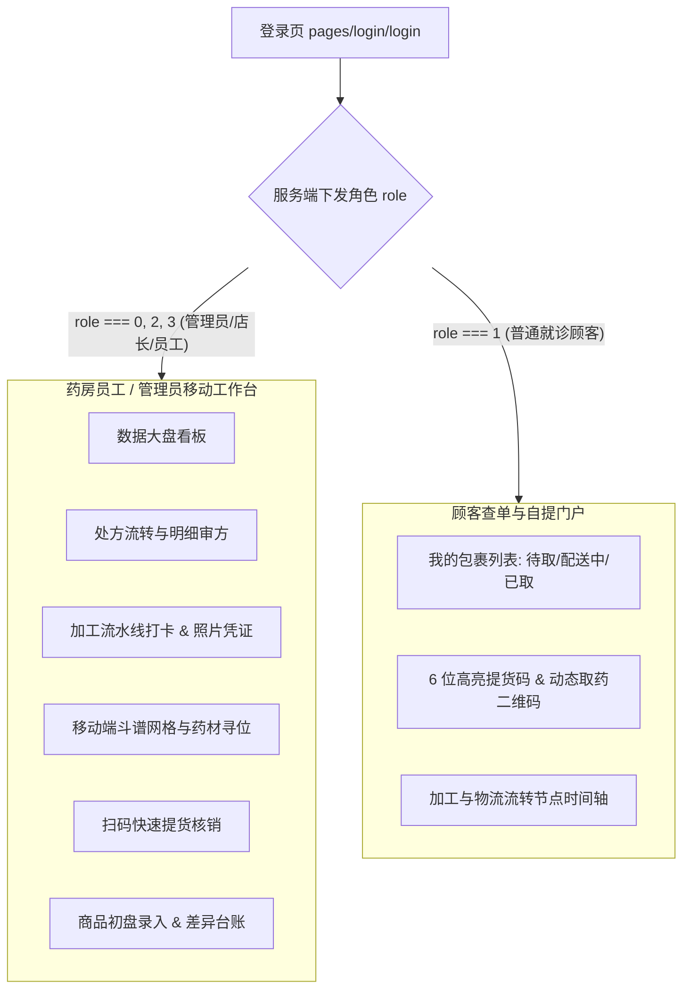

# 微信小程序端 (WeChat Mini Program)

> [!IMPORTANT]
> **技术架构**：微信原生小程序开发 (JavaScript + WXML + WXSS)  
> **UI 组件库**：腾讯官方 [TDesign 微信小程序组件库](https://tdesign.tencent.com/miniprogram/)  
> **组件渲染架构**：微信新一代组件框架 `glass-easel` (`"style": "v2"`)  
> **产品形态**：**双端合一架构**（统一入口登录，自动根据角色动态加载「药房员工工作台」或「顾客查件自提中心」）

---

## 1. 架构总览与双端路由体系

小程序通过单一的代码基座，依托服务端的 RBAC 权限体系，实现了面向两类截然不同的用户群体的自适应交互：



---

## 2. 页面路径清单与功能详解

### 2.1 药房员工端 (`pages/admin/*`)

| 页面路径 | 页面名称 | 核心功能与交互 |
|---|---|---|
| `pages/admin/dashboard/` | 门店移动看板 | 当日处方量、待加工工单数、待提包裹总数与核心告警提醒。 |
| `pages/admin/prescriptions/` | 处方列表 | 支持按患者姓名/手机号检索、状态筛选、查看原始处方影印件。 |
| `pages/admin/prescription-detail/` | 处方详情 | 饮片剂量明细列表、煎煮加工要求、关联的历史加工单。 |
| `pages/admin/processing-workbench/`| 加工流水工作台 | 查看待调配、待浸泡、煎煮中、分装中等各阶段任务卡片。 |
| `pages/admin/processing-operation/`| 工序打卡与核验 | 调配拍照凭证上传、设备编号绑定、加水/煎煮时长记录。 |
| `pages/admin/processing-plan-batch/`| 批量打卡流转 | 针对高峰期多个同类加工任务一键批量完成流转。 |
| `pages/admin/packages/` | 包裹管理 | 包装完成的待领/已领包裹流转台，关联物流单号。 |
| `pages/admin/verify/` | 扫码提货核销 | 调用微信相机毫秒级扫码或人工输入 6 位取货码快速核销并播放核销音效。 |
| `pages/admin/herb-locations/` | 移动查斗网格 | 输入中药名称立即点亮对应的百子柜坐标（如 `3号柜-第2排-左屉`）。 |
| `pages/admin/yd-goods-checks/` | 药店商品盘点 | 手持相机扫药盒条码，现场录入实盘数量，并标记差异原因。 |
| `pages/admin/product-differences/` | 库存差异台账 | 移动端报损/报溢快速登记与撤回。 |
| `pages/admin/store-transfers/` | 门店调拨 | 跨店借还药材确认与接收打卡。 |

### 2.2 顾客端 (`pages/user/*`)

| 页面路径 | 页面名称 | 核心功能与交互 |
|---|---|---|
| `pages/user/packages/` | 我的包裹 | 简洁的时间流设计，一览名下所有中药处方代煎代配进度。 |
| `pages/user/package-detail/` | 取药凭证详情 | 超大字体展示 **6 位防伪提货码**，并利用 `qrcode-2d` 组件生成可被扫码枪识别的高清二维码。 |
| `pages/user/profile/` | 个人中心 | 用户信息查看与退出登录。 |

---

## 3. 本地开发与联调配置

### 3.1 导入微信开发者工具

1. 打开 **微信开发者工具**，点击 **导入项目**。
2. **项目名称**：`tcm-miniprogram`
3. **目录**：选择本地代码库中的 `wechat-miniprogram` 文件夹。
4. **AppID**：使用你注册的测试号或企业小程序 AppID。

### 3.2 依赖构建与 TDesign 编译

项目依赖 TDesign 组件库，首次在本地运行时需执行 npm 构建：

```bash
cd wechat-miniprogram
npm install
```

在微信开发者工具菜单栏中点击：  
**工具 (Tools)** ➔ **构建 npm (Build npm)**。构建成功后会在根目录下生成 `miniprogram_npm/` 资源目录。

### 3.3 接口服务器配置

编辑 `utils/config.js`（或相关网络请求配置文件）：

```javascript
// 本地局域网开发联调（手机预览需开启“不校验合法域名”）
export const API_BASE_URL = 'http://192.168.1.100:3000';

// 生产正式发布环境
// export const API_BASE_URL = 'https://api.tcm.example.com';
```

> [!TIP]
> **本地局域网真机预览技巧**：
> 在微信开发者工具右上角点击 **详情 (Details)** ➔ **本地设置** ➔ 勾选 **“不校验合法域名、web-view (业务域名)、TLS 版本以及 HTTPS 证书”**，手机即可连入同一 Wi-Fi 直接访问电脑本地跑起来的 Fastify 后端。

---

## 4. 关键特性实现机制

### 4.1 2D 画布取药二维码渲染 (`utils/qrcode-2d.js`)

针对微信小程序旧版 Canvas 接口在 Android 上的渲染锯齿与性能问题，本项目全面重构为基于 **Canvas 2D** 规范的零失真矢量打点渲染引擎：
- 动态根据容器宽度（rpx）计算 Canvas 像素比（`pixelRatio`）。
- 确保取药二维码在任何光照、折射条件下均能被门店扫码枪秒级识读。

### 4.2 扫码提货防重校验

在 `pages/admin/verify/verify.js` 中：
- 核销按钮与扫码触发事件增加了防抖拦截（500ms 内禁止重复触发）。
- 接口响应前进入全局 Loading，核销成功后调用系统震动 API（`wx.vibrateShort`）给予药师明确的物理触觉反馈。
